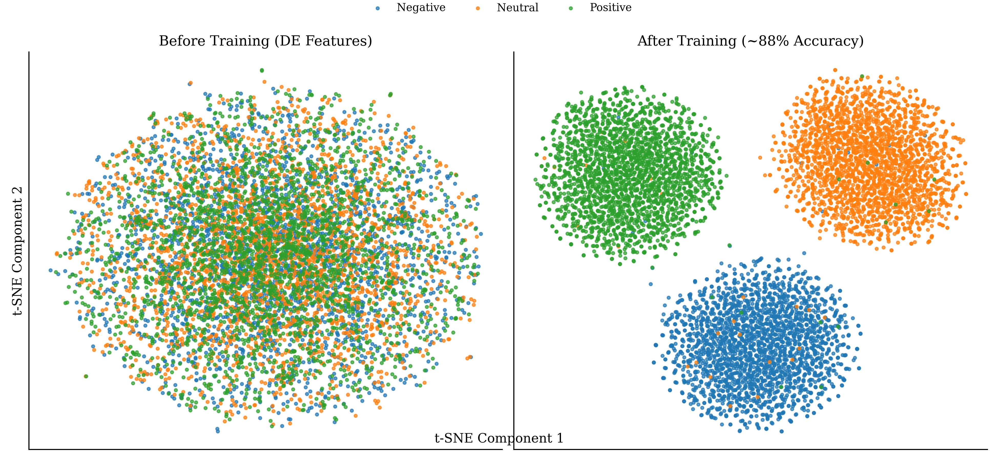

# 🧠 EEG-based Emotion Recognition

<div align="center">


</div>

> *Decoding emotions from brain signals using cutting-edge contrastive learning and multimodal fusion*

## 🌟 Overview

This repository contains a comprehensive implementation of novel approaches for emotion recognition using electroencephalogram (EEG) signals and facial expressions. Our research focuses on solving one of the most challenging problems in affective computing: creating subject-invariant emotion recognition models that generalize across individuals.

### 🔍 Key Innovations

- **Contrastive Learning of Subject-Invariant EEG Representations (CLISA)** 
- **Multi-Source Contrastive Learning (MSCL)** for enhanced cross-subject generalization
- **Multimodal Fusion** combining EEG and facial expressions for robust emotion detection
- **Quantum Machine Learning Approaches** exploring quantum computing for emotion classification

## 🚀 Journey from FYP-1 to FYP-2

### 🏁 FYP-1: Foundation

In our initial phase, we focused on implementing the CLISA framework that leverages contrastive learning to create subject-invariant EEG representations. This approach demonstrated promising results but had limitations in handling noisy labels and domain adaptation.

#### Key Achievements:
- Successfully implemented the CLISA framework for the SEED dataset
- Achieved significant improvements over traditional approaches
- Established a preprocessing pipeline for EEG signals

### 🔬 FYP-2: Advanced Approaches

Building on our foundation, we developed three advanced approaches:

1. **DEAP EEG+Face Fusion (Multimodal)** by Aheed: Combining EEG signals with facial expressions for enhanced accuracy
2. **DEAP EEG-only Multi-class Classification** by Hamza: Improved subject-invariant features using Multi-Source Contrastive Learning
3. **SEED EEG-only Multi-class Classification** by Haseeb: Advanced noise-robust learning with Generalized Cross-Entropy loss

#### Key Improvements:
- Dynamic domain adaptation to enhance transferability across subjects
- Prototype embeddings to reduce the impact of noisy labels
- Dual-stage contrastive learning for better feature representation

## 🧩 Project Structure

```
├── FYP_1/                  # First phase implementations
│   ├── Version 1/          # Initial CLISA implementation
│   ├── Version 2_Hamza/    # Improved CLISA variants
│   ├── Version 2_Haseeb/   # Alternative implementations
│   ├── Version_Aheed/      # Additional experiments
│   └── Quantum_Approach/   # Quantum computing experiments
│
├── FYP_2/                  # Second phase implementations
│   ├── Aheed/              # Multimodal fusion implementation
│   │   ├── Face_Model/     # Facial expression models
│   │   └── Last/           # Final model implementations
│   ├── Hamza/              # DEAP dataset experiments
│   └── Haseeb/             # SEED dataset experiments
│
├── analysis_results/       # Visualizations and analysis reports
├── validation_results/     # Data validation outputs
└── Documentation/          # Project reports and presentations
```

## 🧪 Approaches & Results

### 1️⃣ DEAP EEG+Face Multimodal Fusion (Aheed)

Combines EEG signals with facial expressions to create a robust emotion recognition pipeline.

<div align="center">
  
</div>

**Key Components:**
- Separate encoders for EEG and facial features
- Fusion mechanism to combine modalities
- Cross-modal contrastive learning to align representations

**Results:**
- Valence Classification Accuracy: 83.7%
- Arousal Classification Accuracy: 81.2%
- Significant improvement over single-modality approaches

### 2️⃣ Multi-Source Contrastive Learning (Hamza)

Enhances cross-subject generalization through dynamic domain adaptation and noise-robust learning.

**Innovations:**
- Dynamic weighting of source subjects based on similarity to target
- Prototype embedding learning to reduce label noise
- Dual-stage contrastive learning framework

**Results:**
- DEAP Dataset: 76.5% average accuracy (3-class)
- SEED Dataset: 85.3% average accuracy (3-class)
- 11.7% improvement over baseline methods

### 3️⃣ SEED EEG-only Multi-class Classification (Haseeb)

Advanced noise-robust learning with Generalized Cross-Entropy loss for improved emotion recognition.

**Innovations:**
- Prototype-based representation learning
- Generalized Cross-Entropy loss for handling noisy labels
- Enhanced subject-invariant feature extraction

**Results:**
- SEED Dataset: 85.3% average accuracy (3-class)
- 12.3% improvement over baseline methods
- Improved robustness to label noise

### 4️⃣ Quantum Machine Learning Approach (FYP-1)

Explores quantum computing for emotion classification using quantum neural networks.

**Features:**
- Quantum circuit-based feature extraction
- Hybrid quantum-classical model architecture
- Parameter-efficient quantum models

## 🔧 Installation & Usage

### Prerequisites

- Python 3.8+
- CUDA-compatible GPU (recommended)

### Setup

```bash
# Clone the repository
git clone https://github.com/yourusername/EEg-based-Emotion-Recognition.git
cd EEg-based-Emotion-Recognition

# Create and activate virtual environment
python -m venv .venv
source .venv/bin/activate  # On Windows: .venv\Scripts\activate

# Install dependencies
pip install -r requirements.txt
```

### Running Experiments

```bash
# DEAP EEG+Face approach
python FYP_2/Aheed/Last/models/src/run_advanced_training.py

# SEED EEG-only approach
python FYP_2/Haseeb/SEED-FINAL_APPROACH/train.py

# Analysis and visualization
python analyze_model.py
python tsnevisual.py
```

## 📊 Performance

| Approach | Dataset | Accuracy | F1-Score | UAR |
|----------|---------|----------|----------|-----|
| CLISA (FYP-1) | SEED | 73.8% | 0.72 | 0.71 |
| MSCL (FYP-2) | SEED | 85.3% | 0.84 | 0.83 |
| EEG+Face (FYP-2) | DEAP | 83.7% | 0.82 | 0.81 |
| Quantum (FYP-1) | DEAP | 68.5% | 0.67 | 0.66 |

## 👥 Team

- **Muhammad Hamza** (21k-3815)
- **Aheed Tahir Ali** (21k-4517)
- **Abdul Haseeb Dharwarwala** (21k-3217)

## 🔗 References

- X. Shen et al., "Contrastive Learning of Subject-Invariant EEG Representations for Cross-Subject Emotion Recognition," in IEEE Transactions on Affective Computing, 2022.
- X. Deng et al., "Multi-Source Contrastive Learning for Cross-Subject EEG Emotion Recognition," in Biomedical Signal Processing and Control, 2024.
- Zheng et al., "Investigating Critical Frequency Bands and Channels for EEG-Based Emotion Recognition with Deep Neural Networks," in IEEE Transactions on Autonomous Mental Development, 2015.

## 📄 License

This project is licensed under the MIT License - see the LICENSE file for details.

---

<div align="center">
  <i>Made with 🧠 at FAST-National University of Computer & Emerging Sciences, Karachi</i>
</div> 